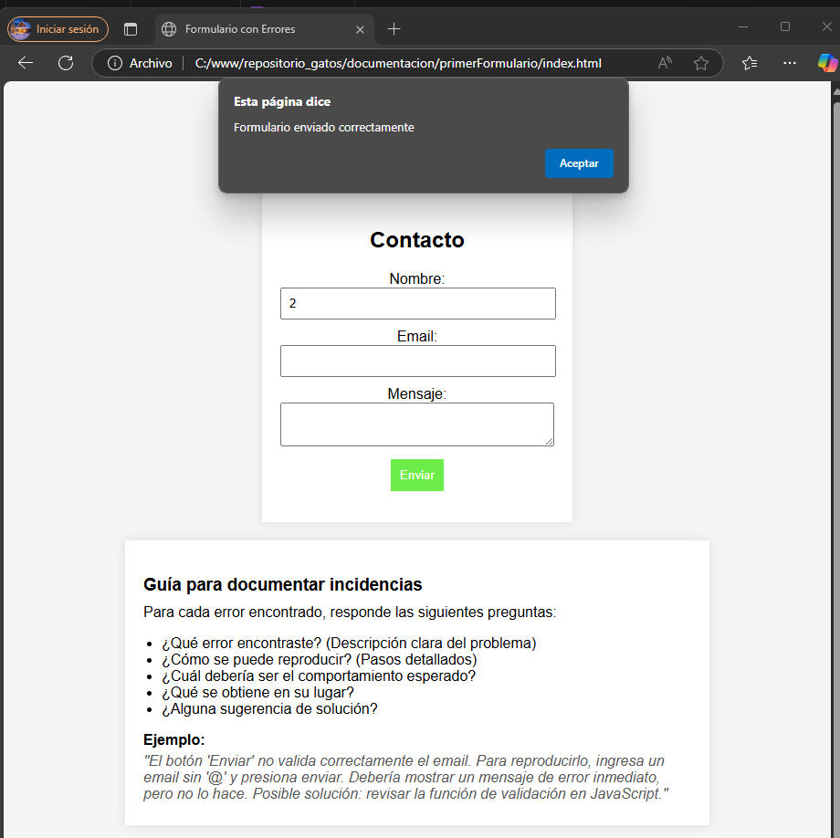
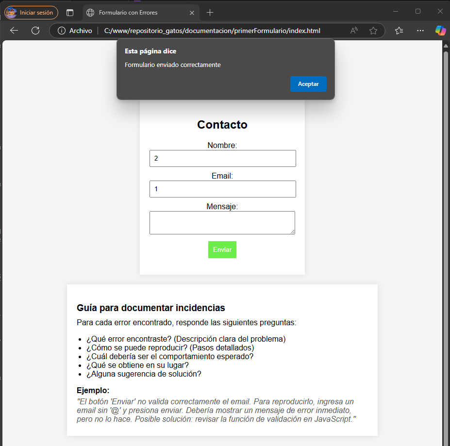
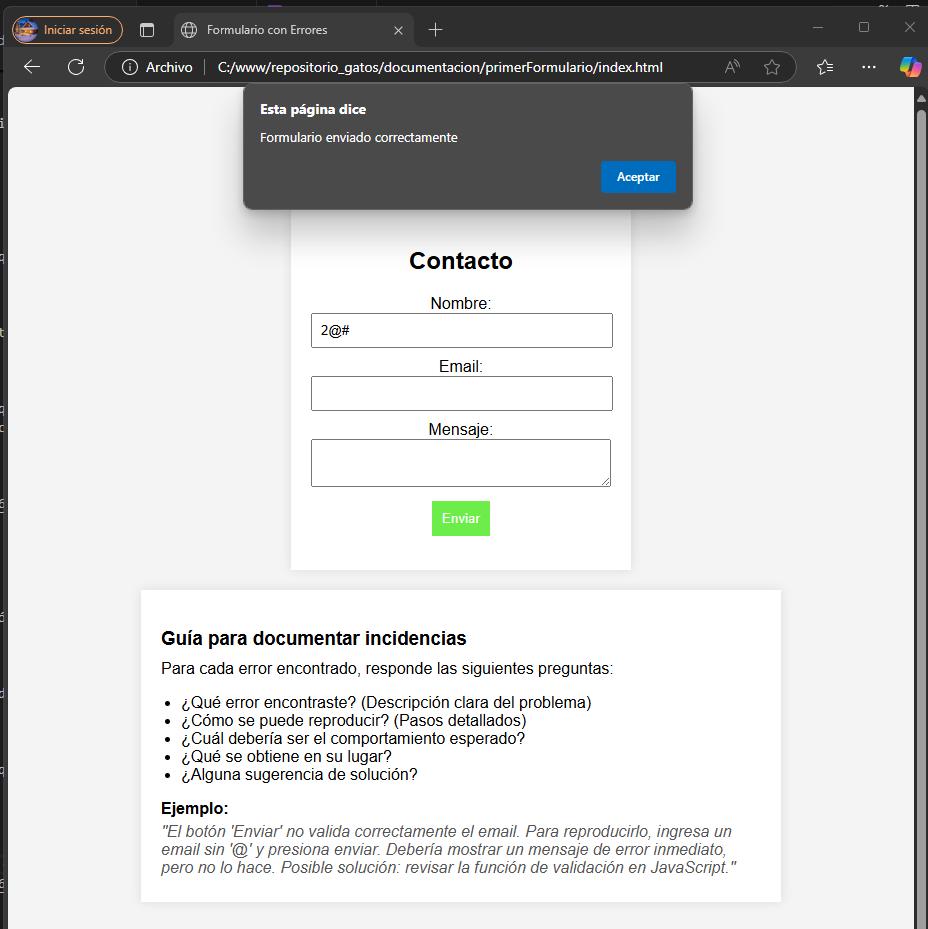
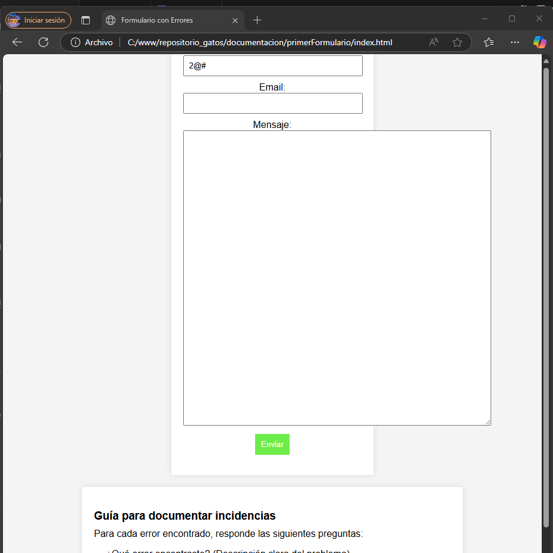

## ERRORES ENCONTRADOS EN EL FORMULARIO

¿Qué error encontraste? (Descripción clara del problema)
¿Cómo se puede reproducir? (Pasos detallados)
¿Cuál debería ser el comportamiento esperado?
¿Qué se obtiene en su lugar?
¿Alguna sugerencia de solución?

1. 

### 1.1. Descripción del problema: 

Permite enviar el formulario introduciendo únicamente el campo 'nombre' aunque no se introduzca el correo ni el contenido del mensaje.

### 1.2. Reproducción: 

Si pulsas enviar el formulario vacío te salta un aviso, pero si rellenas únicamente el campo nombre este aviso desaparece y salta un alert informándote de que el formulario ha sido enviado.

### 1.3. Comportamiento esperado: 

Para recibir un formulario, debe ser necesario que los tres campos sean rellenados porque no tiene sentido que una empresa reciba un formulario sin un cliente que sea identificable o sin el cuerpo del mensaje porque no sabe el motivo por el que lo envía.

### 1.4. Qué se obtiene en su lugar.

Imagen del resultado: .

### 1.5. Sugerencia de solución

Modificar el html para que los tres campos mencionados tengan el atributo 'required', de manera que el usuario no pueda enviar el formulario sin rellenar todos los campos antes.

2. 

### 2.1. Descripción del problema: 

El email está indicado de tipo texto de manera que permite que el usuario introduzca cualquier tipo de caracteres, no solamente una dirección de correo electrónico.

### 2.2. Reproducción: 

Si rellenas el nombre y el email con cualquier tipo de caracteres (por ejemplo, números) el formulario se envía.

### 2.3. Comportamiento esperado: 

Para recibir un formulario, debe ser necesario que en el campo email el usuario introduzca una dirección de correo electrónico, que se caracteriza por la inclusión del caracter @ (más el servicio de correo electrónico que tenga el usuario).

### 2.4. Qué se obtiene en su lugar.

Imagen del resultado: 

3. 

### 3.1. Descripción del problema: 

En el campo nombre no se establece una limitación de caracteres de manera que el usuario puede introducir números y caracteres especiales.

### 3.2. Reproducción: 

Si rellenas el campo nombre con cualquier tipo de caracteres (por ejemplo, números o caracteres especiales) el formulario igualmente se envía.

### 3.3. Comportamiento esperado: 

Para recibir un formulario, debe ser necesario que el campo nombre permita solamente que el usuario introduzca letras, pues normalmente los nombres de personas no incluyen números ni caracteres especiales.

### 3.4. Qué se obtiene en su lugar.

Imagen del resultado: 

4. 

### 4.1. Descripción del problema: 

En el campo mensaje no se establece una limitación de tamaño de recuadro de forma que es posible hacerlo más grande que el cuadro del formulario.

### 4.2. Reproducción: 

Si pasas el ratón sobre la esquina inferior derecha del recuadro de mensaje, se permite aumentar el tamaño del recuadro sin ningún tipo de limitación.

### 4.3. Comportamiento esperado: 

Este recuadro bien debería tener un tamaño fijo o bien que se pueda desplazar únicamente hacia abajo.

### 4.4. Qué se obtiene en su lugar.

Imagen del resultado: 